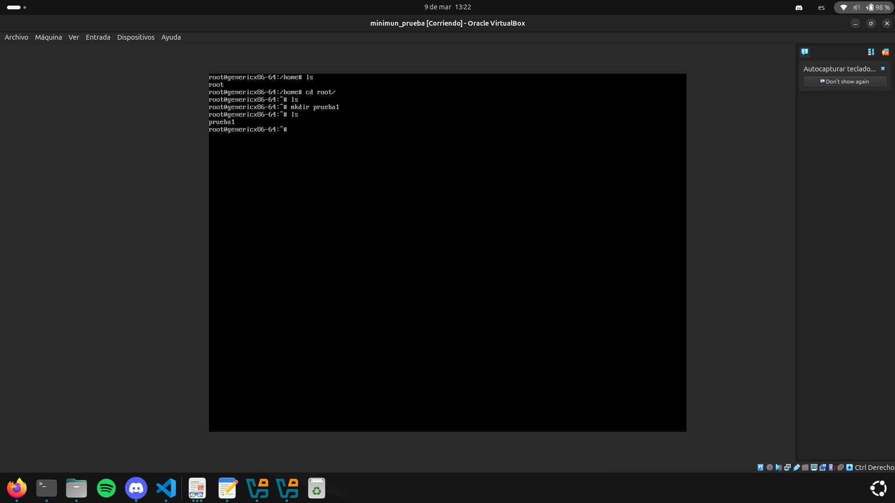
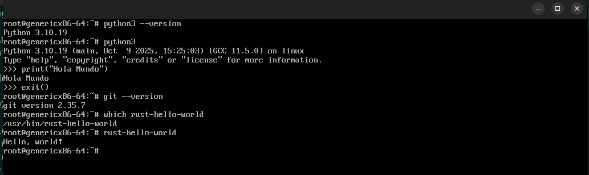
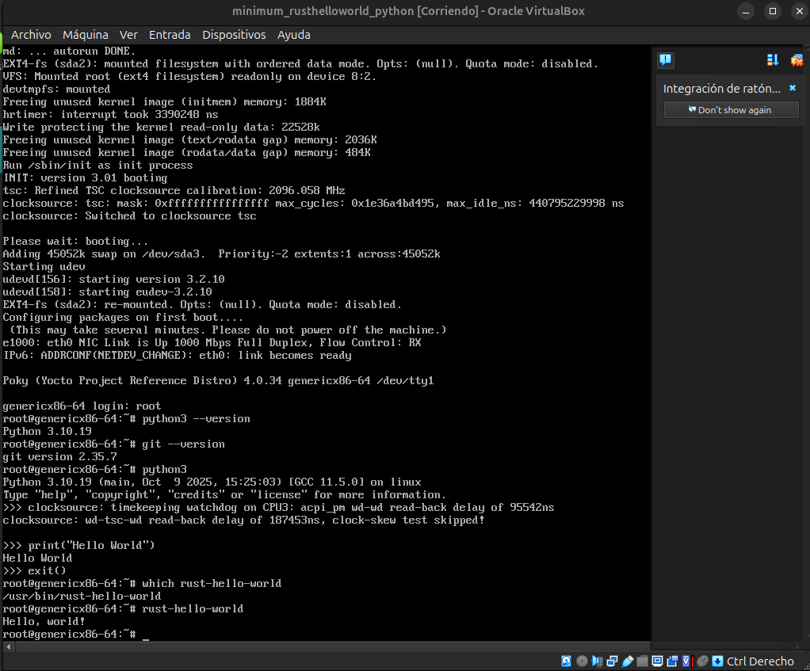
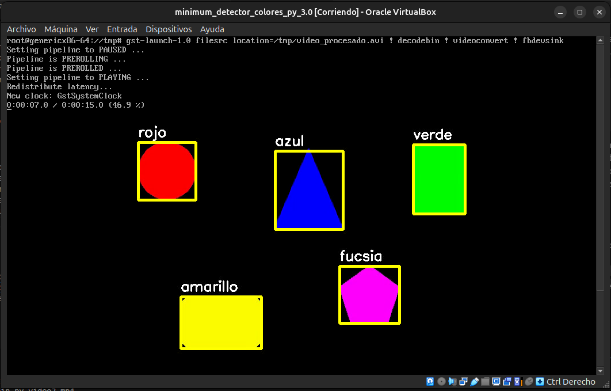

## **Fecha:** 02/03/2026 - **Participante:** Gabriel Pérez

- Se instala Yocto Project, versión Kirkstone 4.0.33, usando la guía oficial de la página [Yocto](https://docs.yoctoproject.org/kirkstone/brief-yoctoprojectqs/index.html) . Además, se genera una imagen mínima usando el comando `core-image-minimal`, la cual luego se corre con `runqemu qemux86-64`.

## **Fecha:** 04/03/2026  - **Participante:** Gabriel Pérez

- Con el fin de entender cómo usar opencv, se sigue un ejemplo, [Video](https://www.youtube.com/watch?v=aFNDh5k3SjU&list=PLb49csYFtO2Hpfn8eLnaD9tJ0xYcMVcWe), en el cual se implementa un código de detección de colores usando la cámara de la computadora, esto usando python. 
- En este lo primero que se hace es crear un entorno virtual, en el que luego se van a instalar algunas librerías necesarias y ejecutar el proyecto. Para esto se corren los siguientes comandos en la terminal.

  ```bash
    # Instala paquetes para poder crear el entorno virtual  
    sudo apt install python3-full python3-venv 

    # Se navega hasta estar en el directorio deseado. Luego se crea el entorno
    python3 -m venv venv

    # Se activa el entorno
    source venv/bin/activate

    # Ahora se instalan los requerimientos
    pip install -r requirements.txt
  ```

- Luego, se toman los códigos presentes en el repositorio del autor del video, [Repo](https://github.com/computervisioneng/color-detection-opencv/blob/master/main.py), y se corre dicho código.


- También se recrea el código que se muestra en [Video](https://www.youtube.com/watch?v=zcfixnuJFXg), en el cual se hace una aplicación sencilla usando Rust y OpenCV. Para esta lo primero que se hizo fue instalar Rust desde la página oficial. Luego de esto se siguió el video hasta tener el código listo. Al tratar de correrlo con `cargo run`, la compilación daba error. Esto es dado que no tenía instaladas las dependencias de OpenCV, por lo que se ejecuta `sudo apt install -y build-essential cmake pkg-config ninja-build libopencv-dev libgtk-3-dev libv4l-dev libavcodec-dev libavformat-dev libswscale-dev`. Luego de esto, el programa funciona correctamente, mostrando la cámara en vivo de la laptop.

## **Fecha:** 08/03/2026 - **Participante:** Gabriel Pérez
- Se decide crear una imagen mínima y ejecutarla en una máquina virtual. Para esto se sigue, entre otros recursos, el tutorial que se muestra en [Página](https://gmacario.github.io/posts/2015-11-14-running-yocto-image-inside-virtualbox). Lo primero que se hace es instalar la aplicación Oracle VirtualBox, esto desde la página oficial. Una vez se tenía lista, se pone a cocinar la imagen mínima, pero antes de eso, en el archivo `/home/gabo/poky/build/conf/local.conf` se añade la línea:
   ```bash
    #Image Format
    IMAGE_FSTYPES += "wic.vmdk wic iso"
  ```
- Esto hace que se genere la imagen con un formato que es posible ejecutar en el VirtualBox. Luego de generada, en VirtualBox se elige el crear una nueva máquina. En esta se especifica un nombre, se coloca el sistema operativo como Linux, la versión como Other Linux y que sea de 64 bits. Luego de esto, se eligen 1024 MB de memoria base y 4 núcleos de procesamiento. Luego, en la selección del disco virtual, se elige la opción de usar un disco duro virtual existente, en donde se elige el archivo `/home/gabo/poky/build/tmp/deploy/images/genericx86-64/core-image-minimal-genericx86-64.wic.vmdk`. Finalmente, se abre la máquina virtual y se verifica que esta ejecuta correctamente.

<figure style="text-align: center; margin: 20px auto;">
  
  <figcaption style="font-style: italic; color: #666;">Máquina Virtual de imagen mínima</figcaption>
</figure>

## **Fecha:** 09/03/2026 - **Participante:** Gabriel Pérez
- Se quiere ver el procedimiento para poder generar una imagen que ya no sea vanilla, es decir, que se pueda poner algo en las recetas. En este caso, en primera instancia se busca cocinar una imagen mínima, la cual tenga posibilidad de usar los paquetes de git, python y rust. Con estos debidamente configurados, se quiere confirmar que realmente se puedan ejecutar códigos dentro de la imagen.
- Para empezar se está tomando información de una serie de videos de YouTube, específicamente de [Playlist](https://www.youtube.com/playlist?list=PLwqS94HTEwpQmgL1UsSwNk_2tQdzq3eVJ).
- Una de las cosas que menciona el autor en [Video](https://www.youtube.com/watch?v=naszh2WoHAM&list=PLwqS94HTEwpQmgL1UsSwNk_2tQdzq3eVJ&index=6), es que hay que confirmar si los paquetes que se quieren agregar a la receta están disponibles de antemano. Para ver esto se usa el código
```bash
source oe-init-build-env 
# Mostrar todas las recetas
bitbake-layers show-recipes
# Mostrar receta específica
bitbake-layers show-recipes python3
```
- El resultado de esto se ve a continuación:
```bash
NOTE: Starting bitbake server...
Loading cache: 100% |############################################ Time: 0:00:00
Loaded 1644 entries from dependency cache.
=== Matching recipes: ===
git:
meta                 2.35.7
```
- Entonces, lo que hay que hacer es añadir el layer "meta" al archivo `/home/gabo/poky/build/conf/bblayers.conf`. Sin embargo, esto ya se encuentra ahí, como se puede ver en seguida:
```bash
BBLAYERS ?= " \
  /home/gabo/poky/meta \
  /home/gabo/poky/meta-poky \
  /home/gabo/poky/meta-yocto-bsp \
  "
```
- De no haber estado, se puede añadir con el comando `bitbake-layers add-layer meta`.

- Luego de esto, se deben añadir los paquetes específicos que se necesitan dentro del archivo `/home/gabo/poky/build/conf/local.conf`. En la parte final de este se coloca:

```bash
IMAGE_INSTALL:append = " \
    python3 \
    git \
    rust-hello-world \
"
```

- Ya con las configuraciones ejecutadas, se procede a cocinar la imagen. Esta luego se prueba usando el comando `runeqemu genericx86-64`. En esta se comprueba que están disponibles los programas deseados, además de que se prueba el python y el rust, tal como se muestra a continuación:

<figure style="text-align: center; margin: 20px auto;">
  
  <figcaption style="font-style: italic; color: #666;">Comprobación de imagen mínima con Rust y Python</figcaption>
</figure>

- Finalmente se prueba la imagen desde VirtualBox, y se comprueba su correcto funcionamiento.
<figure style="text-align: center; margin: 20px auto;">
  
  <figcaption style="font-style: italic; color: #666;">Comprobación de imagen mínima con Rust y Python, en VirtualBox</figcaption>
</figure>

## **Fecha:** 14/03/2026 y 15/03/2026 - **Participante:** Gabriel Pérez

- Se busca realizar una imagen mínima, pero que tenga la posibilidad de reproducir un video dentro de esta. Para esto se decide usar el reproductor gstreamer1.0, el cual está disponible dentro del layer meta. Para agregar este paquete en la siguiente imagen, simplemente se agrega al archivo `local.conf`. Mientras que para agregar el video, se debe crear una nueva layer, en donde posteriormente se va a agregar la receta que propiamente incluye al archivo de mp4. Para crear el layer se siguen los siguientes comandos.

```bash
    source oe-init-build-env
    bitbake-layers create-layer meta-proyecto1
    bitbake-layers add-layer meta-proyecto1
```

- En primera instancia se va a crear el directorio en el que va a generarse la receta para archivos de video, para esto se debe colocar la terminal dentro de la carpeta de la layer propia, es decir, `meta_proyecto1`. Luego se usa el comando:

```bash
    mkdir -p recipes-media/mi-video/files
```
- Luego de esto, se copia el video en cuestión dentro de la carpeta `files`. Además, debe crearse un archivo de tipo `LICENSE`, dentro de la misma carpeta. En seguida, se debe obtener el dato de la suma md5 del archivo de licencia. Este dato se usa para comprobar la integridad del archivo en cuestión. Para esto se usa, estando dentro de la carpeta `files`.

```bash
    md5sum LICENSE
```

- Luego de esto, lo que se hace es crear un archivo de tipo .bb, en el cual se coloca propiamente la receta. Este debe ubicarse en la carpeta `recipes-media/mi-video`, y en este caso debe contener lo siguiente.

```bash
    # Descripción corta del paquete.
    SUMMARY = "Instala un video dentro de la imagen"

    # Indica que el contenido tiene licencia cerrada.
    LICENSE = "CLOSED"

    # Archivo de licencia y su MD5 para verificar integridad.
    LIC_FILES_CHKSUM = "file://LICENSE;md5=092cecf55e2bc9a2a5e8378656d2d161"

    # Archivos fuente que BitBake copiará al WORKDIR.
    SRC_URI = "file://video.mp4 \
            file://LICENSE \
    "

    # Directorio donde BitBake considera que están los archivos fuente.
    S = "${WORKDIR}"

    # Indica que el paquete es independiente de la arquitectura.
    inherit allarch

    # Tarea que copia archivos al rootfs temporal (${D}).
    do_install() {

        # Crea el directorio destino /usr/share/videos.
        install -d ${D}${datadir}/videos

        # Copia el video al rootfs con permisos de solo lectura para usuarios.
        install -m 0644 ${S}/video.mp4 ${D}${datadir}/videos/video.mp4

        # Copia también el archivo de licencia.
        install -m 0644 ${S}/LICENSE ${D}${datadir}/videos/LICENSE
    }

    # Define qué archivos pertenecen al paquete final.
    FILES:${PN} += "${datadir}/videos ${datadir}/videos/*"
```

- Ahora, se debe cocinar la receta de manera individual, para confirmar que esta funciona, y luego agregarla a la imagen. Para esto se usa el comando: 

```bash
    source oe-init-build-env
    bitbake mi-video
```

- La generación de esta receta dio bastantes errores. El código que se muestra como contenido del .bb de la receta es la versión final. Antes de llegar a este, daba errores como que el bitbake estaba instalando los archivos en el `sysroot (${D})`, pero que no los incluyó en ningún paquete, es decir, problemas en cómo bitbake estaba empaquetando los paquetes. 
- Para realizar una verificación de que la receta se creó y empaquetó correctamente, se pueden usar los siguientes comandos: 

```bash
    # lista los paquetes creados por la build (debe aparecer "mi-video")
    oe-pkgdata-util list-pkgs | grep mi-video || true

    # lista los archivos incluidos en el paquete mi-video
    oe-pkgdata-util list-pkg-files mi-video || true
    # Salida esperada
    # /usr/share/videos/video.mp4
    # /usr/share/videos/LICENSE
```
- Luego, se agrega la receta al `local.conf` para que esté disponible dentro de la imagen, la cual se crea exitosamente. Dentro de esta se verifica que el video exista, el cual está ubicado en la ruta `usr/share/videos/video.mp4`. 
- Igualmente, se verifica que el gstreamer esté disponible viendo su versión con `gst-launch-1.0 --version`. No obstante, al tratar de abrir el video con esta herramienta, se da el caso de que ninguno de los comandos / plugins funciona. Se cree que es dado que en la receta solo se agregó la línea `gstreamer1.0`. Se van a agregar ahora de forma que quede:

```bash
    IMAGE_INSTALL:append = " \
            python3 \
            git \
            vim \
            gstreamer1.0 \
            gstreamer1.0-plugins-base \
            gstreamer1.0-plugins-good \
            gstreamer1.0-plugins-bad \
            gstreamer1.0-libav \
            gstreamer1.0-plugins-ugly \
            mi-video \
        "
        
    LICENSE_FLAGS_ACCEPTED = "commercial"
```
- Parece que con esto el video sí si está corriendo, no obstante, dado que la imagen no posee entorno gráfico, no se puede observar el video. Se agregan algunas recetas más y con estas se logra correr el video con el comando `runqemu genericx86-64`. Ahora se tiene que solucionar el hecho de que no funciona en la máquina virtual. Con agregar los siguientes paquetes se logra reproducir el video.

```bash
    GE_INSTALL:append = " \
            python3 \
            git \
            vim \
            gstreamer1.0 \
            gstreamer1.0-plugins-base \
            gstreamer1.0-plugins-good \
            gstreamer1.0-plugins-bad \
            gstreamer1.0-libav \
            gstreamer1.0-plugins-ugly \
            mi-video \
            xserver-xorg \
            xinit \
            matchbox-wm \
        "
        
    LICENSE_FLAGS_ACCEPTED = "commercial"
```
- Dentro de la VM se usa `gst-launch-1.0 filesrc location=/usr/share/videos/video.mp4 ! decodebin ! videoconvert ! fbdevsink`. Con eso se obtiene:

<figure style="text-align: center; margin: 20px auto;">
  
  <figcaption style="font-style: italic; color: #666;">Comprobación de imagen mínima con Rust y Python, en VirtualBox</figcaption>
</figure>

- Finalmente se determina que con las siguientas recetas es suficiente para que el video se reproduzca de manera correcta dentro de la VM.

```bash
    IMAGE_INSTALL:append = " \
            python3 \
            git \
            vim \
            gstreamer1.0 \
            gstreamer1.0-plugins-base \
            gstreamer1.0-plugins-good \
            gstreamer1.0-plugins-bad \
            gstreamer1.0-libav \
            gstreamer1.0-plugins-ugly \
            mi-video \
        "
```

## **Fecha: 16/03/26** - **Participante: Gabriel**

- Se quiere crear una imagen que se pueda correr en la VM, en la cual se pueda correr un código de python en el que se abra un video y en este se haga una detección de colores, usando OpenCV.
- Para esto se crea el código fuente y se prueba en la computadora nativa. Luego de confirmar que funciona correctamente, se buscan generar las recetas del código y del video para que estas puedan usarse en la VM. El código se coloca en la dirección `meta-proyecto1/recipes-apps/reconocimiento-colores-py/files` y el `.bb` justo afuera de la última carpeta. Este último se ve como:

```bash
    SUMMARY = "Script de Python para reconocimiento de colores"
    DESCRIPTION = "Instala un script Python personalizado dentro de la imagen"
    LICENSE = "CLOSED"

    SRC_URI = "file://detector_colores.py"

    # Carpeta donde bitbake coloca los archivos traídos con file://
    S = "${WORKDIR}"

    # No depende de arquitectura (solo copia un script)
    inherit allarch

    do_install() {
        # Crear directorio /usr/bin en la imagen
        install -d ${D}${bindir}

        # Copiar el script Python y hacerlo ejecutable
        install -m 0755 ${WORKDIR}/detector_colores.py ${D}${bindir}/detector_colores.py
    }

    # Declarar que este archivo pertenece al paquete
    FILES:${PN} += "${bindir}/detector_colores.py"

    # Dependencias necesarias para ejecutar Python
    RDEPENDS:${PN} += "python3"
```
- El cocinar esta receta se hizo con el comando `bitbake reconocimiento-colores-py`. Este inicialmente dio problemas dado que se estaban usando guiones bajos como separador de palabras, al cambiarlos por guiones normales acabaron los problemas.
- Mientras que para el video se sigue una metodología similar a la del primer video añadido.
- Para correr el video se necesita acceso a algunas bibliotecas, como numpy y opencv. Para esto se agrega la receta `python3-numpy` al archivo `local.conf`. Ahora, el opencv no está disponible en las layers que se tienen actualmente. Es por esto que se siguen los siguientes comandos para tener disponible esta biblioteca en forma de receta.

```bash
    git clone -b kirkstone https://github.com/openembedded/meta-openembedded.git
    bitbake-layers add-layer ../meta-openembedded/meta-oe
```

- Ahora, dentro del archivo `local.conf` se agrega la receta `opencv`. Dicho archivo queda como:

```bash
IMAGE_INSTALL:append = " 
        python3 \
        opencv \
        python3-numpy \
        git \
        vim \
        gstreamer1.0 \
        gstreamer1.0-plugins-base \
        gstreamer1.0-plugins-good \
        gstreamer1.0-plugins-bad \
        gstreamer1.0-libav \
        gstreamer1.0-plugins-ugly \
        video2 \
        reconocimiento-colores-py \
    "
```

### Errores / Problemas:
- Guiones bajos no permitidos para nombres en poky.
- Inicialmente se clonó el meta-openembedded de otra versión de poky, lo cual se corrigió instalando el de la versión de kirkstone.


## **Fecha: 20/03/26** - **Participante: Gabriel**

- Ya con las recetas nuevas creadas y cocinadas, se cocina nuevamente la imagen mínima. Esta logra ejecutarse correctamente en la VM. Al correr el código dentro de esta se ve un error con una línea de código, esto dado que estas requieren de una interfaz gráfica para funcionar.

```python
    cv2.imshow("frame", frame)
    if cv2.waitKey(delay) & 0xFF == ord("q"):
        break
```
- Una idea que se tiene es que el video no se muestre "en vivo" con la ejecución del código, sino que este se ejecute y cree un nuevo video que tenga el efecto del código de python. Con este nuevo video creado de manera independiente, con Gstreamer se puede abrir y verificar su correcto resultado. Hubo una dificultad para ejecutar el comando que reproduce el video, pero se logra identificar que era que se estaba escribiendo `videocovert` en lugar de `videoconvert`.
- Finalmente, el código se ejecuta sin mostrar el video, pero genera un archivo de video con el resultado, esto en la ruta `/tmp/videoprocesado.avi`. Evidencia de este video se muestra en seguida:

<figure style="text-align: center; margin: 20px auto;">
  
  <figcaption style="font-style: italic; color: #666;">Resultado del código de python en la VM</figcaption>
</figure>

### Errores / Problemas:
- Apertura de video dentro de la VM. En el código original este requiere de una interfaz gráfica para funcionar.
- Error al reproducir un video en la VM, con el comando que ya antes había funcionado, `gst-launch-1.0 filesrc location=/usr/share/videos/video.mp4 ! decodebin ! videoconvert ! fbdevsink`. Dice que no hay un elemento llamado `videoconvert`.


## **Fecha: 21/03/2026** - **Participante: Gabriel**

- Se quiere crear una imagen que pueda correr de manera solvente código en Rust. De momento no se tiene claro si lo ideal es agregar todas las herramientas de este lenguaje a la imagen, como cargo, o si se podrá generar el código y algún tipo de ejecutable desde la máquina, luego cocinar la receta de esta y que sea este el que se ejecute dentro de la VM.
- De momento se está tratando de implementar un código detector de colores sencillo, el cual usa opencv. Está dando errores a la hora de hacer el `cargo build`, específicamente con el `opencv`. Para agregar el `opencv`, hay que ejecutar el comando `cargo add opencv`. Este va a agregar la biblioteca al archivo `Cargo.toml`. Parece que en realidad el error venía del código propiamente, algo relacionado con los préstamos de las máscaras que no se estaba implementando de manera correcta.
- Ya con este código funcional, se decide adaptarlo para que no necesite una interfaz gráfica, sino que genere un video resultante. Esto con el fin de que pueda ejecutarse en la VM.
- Para esto hay que identificar qué layers y recetas hay que agregar en el bitbake de la imagen. Se va a importar una layer llamada `meta-rust-bin`. Esta permite compilar el archivo de rust en la creación de la imagen, pero no propiamente en el target. Parece conveniente, para no agrandar la imagen más de lo estrictamente necesario. Esta se puede obtener con el comando:

```bash
git clone https://github.com/rust-embedded/meta-rust-bin.git
bitbake-layers add-layer ../meta-rust-bin
```
- La otra opción sería bajar `meta-rust`, el cual sí hace posible usar cargo y compilar dentro del target, esto con:

```bash
git clone https://github.com/meta-rust/meta-rust.git
bitbake-layers add-layer ../meta-rust
```

- Entonces se busca cocinar la receta del código de rust. El árbol de esta queda como:

```bash
meta-proyecto1/
└── recipes-apps/
    └── detector-colores-rust/
        ├── detector-colores-rust_0.1.bb
        └── files/
            ├── Cargo.toml
            ├── Cargo.lock
            └── src/main.rs
```
- Y el contenido del .bb es:

```bash
SUMMARY = "Detección de color en video con Rust y OpenCV"
LICENSE = "CLOSED"

SRC_URI = "file://Cargo.toml \
           file://Cargo.lock \
           file://src/main.rs \
"

S = "${WORKDIR}"

inherit cargo_bin

do_compile[network] = "1"

DEPENDS += "opencv"
```

- Al tratar de cocinar la receta de manera individual, esta da errores con respecto a una dependencia, llamada `clang`. Dado esto, se necesita agregar esta al poky. Esto se hace con:

```bash
git clone -b kirkstone https://github.com/kraj/meta-clang.git
bitbake-layers add-layer ../meta-clang
```

- Luego de agregar el `meta-clang`, la receta del código dn rust sí se cocinó correctamente, al igual que la imagen mínima. Queda pendiente comprobar el funcionamiento del código dentro de la VM.

### Errores / Problemas
- Fallo con el `cargo build`, específicamente con el `opencv`.
- Falta dependencia `clang` al cocinar la receta con el código de rust.


## **Fecha: 26/03/2026** - **Participante: Gabriel**

- El último día de trabajo se consiguió cocinar la imagen mínima con el código de Rust, ver si este funciona es la primera comprobación que se busca hacer.

- Antes de probar esto, se decide crear una receta sencilla, que simplemente sea un atajo para poder ingresar el comando que reproduce el video dentro de la VM. La receta se llama `video-player-cmd` y su árbol está conformado por:

```bash
meta-proyecto1/
└── recipes-apps/
    └── video-player-cmd/
        ├── video-player-cmd.bb
        └── files/
            └── reproducir_video.sh
```

- El comando que permite el atajo es `reproducir_video /ruta/video/a/reproducir`.

- Dentro de la imagen se logra comprobar que al ejecutar el binario creado del código en rust, se crea de manera satisfactoria el video ya con la intervención de dicho código. Dentro de la VM el código se ejecuta con `/usr/bin/detector-colores-rust-VM /usr/share/videos/video2.mp4`. Luego de eso, se reproduce el video con el comando `reproducir-video /tmp/video_procesado.avi`. Esto se puede observar a continuación:

<figure style="text-align: center; margin: 20px auto;">
  
  <figcaption style="font-style: italic; color: #666;">Detección de un color usando código de rust, dentro de VirtualBox</figcaption>
</figure>

- Dentro del `local.conf` las líneas agregadas quedan como:

```bash
IMAGE_FSTYPES += "wic.vmdk wic iso"
#IMAGE_FSTYPES += "vmdk"

# Limitar el uso de CPU durante la construcción
BB_NUMBER_PARSE_THREADS ?= "1"
BB_NUMBER_THREADS ?= "2"
PARALLEL_MAKE ?= "-j 2"

IMAGE_INSTALL:append = " \
        opencv \
        gstreamer1.0 \
        gstreamer1.0-plugins-base \
        gstreamer1.0-plugins-good \
        gstreamer1.0-plugins-bad \
        gstreamer1.0-libav \
        gstreamer1.0-plugins-ugly \
        video2 \
        reconocimiento-colores-rust \
    video-player-cmd \
    "
    
LICENSE_FLAGS_ACCEPTED = "commercial"
```

- Mientras que dentro del `bblayers.conf` las líneas agregadas quedan como:

```bash
BBLAYERS ?= " \
  /home/gabo/poky/meta \
  /home/gabo/poky/meta-poky \
  /home/gabo/poky/meta-yocto-bsp \
  /home/gabo/poky/build/meta-proyecto1 \
  /home/gabo/poky/meta-openembedded/meta-oe \
  /home/gabo/poky/meta-rust-bin \
  /home/gabo/poky/meta-clang \
  "
```

### Errores / Problemas
- En un descuido se creó la imagen sin haber cambiado la receta del reconocimiento de colores, por lo que se agregó nuevamente la de python en lugar de la de rust.