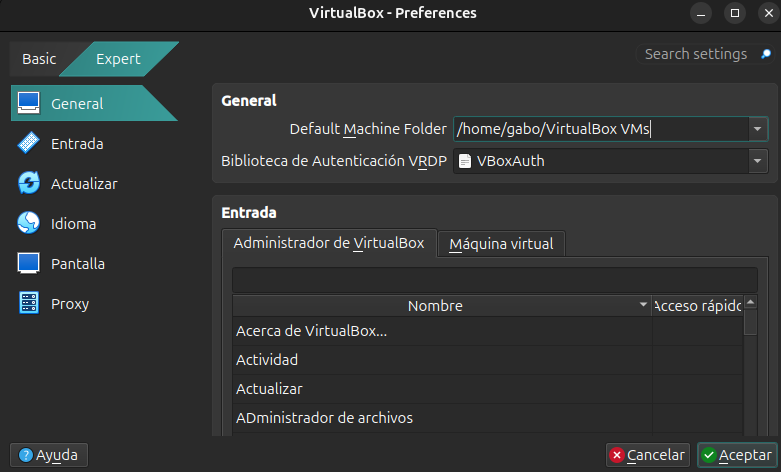
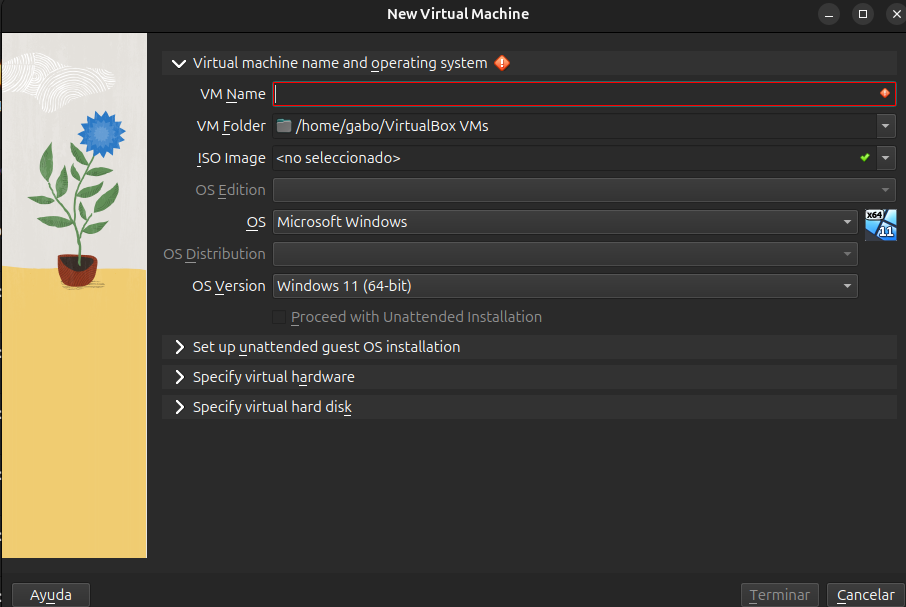
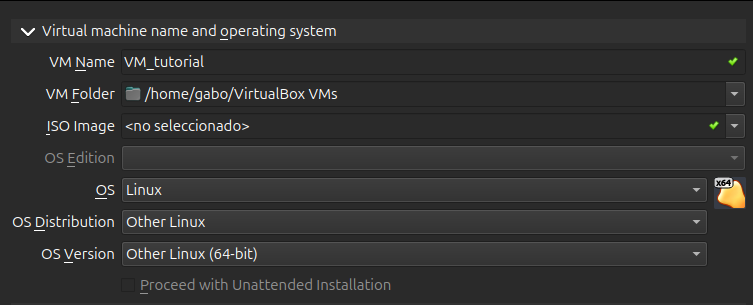
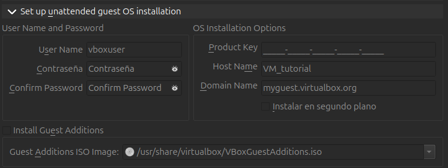
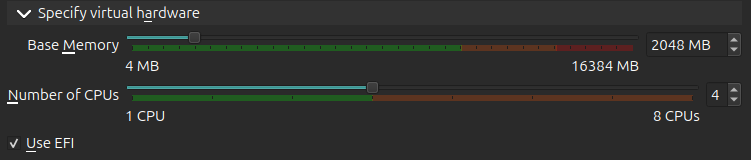
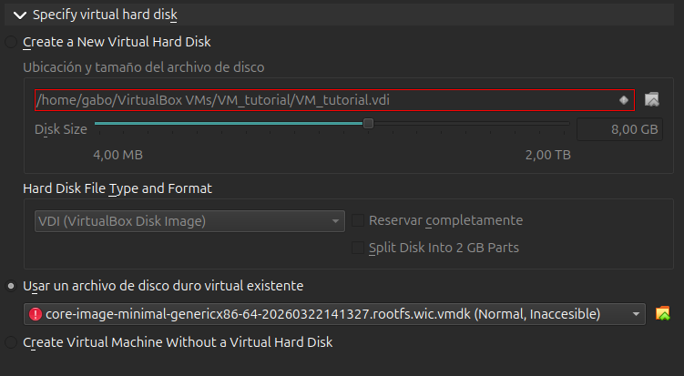
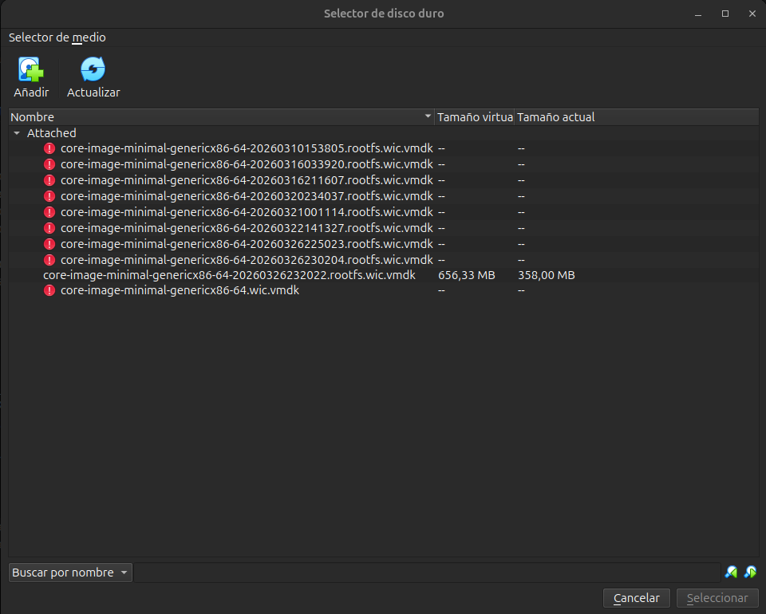
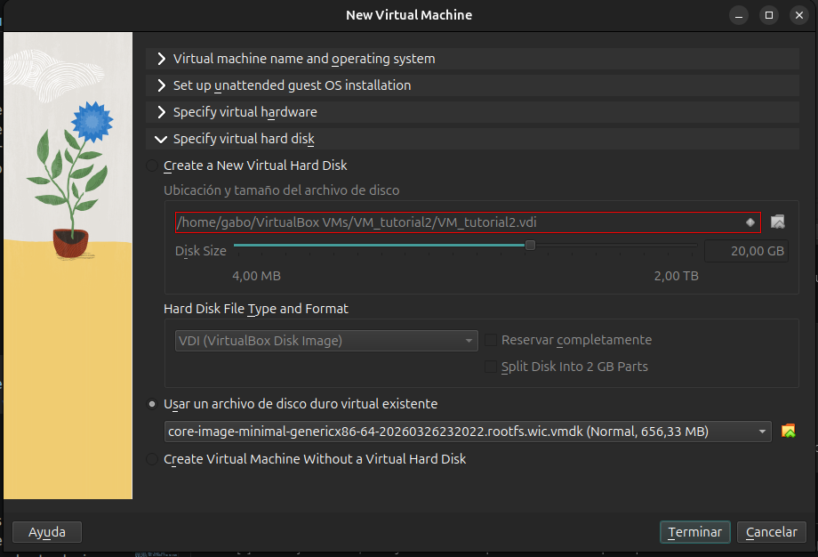
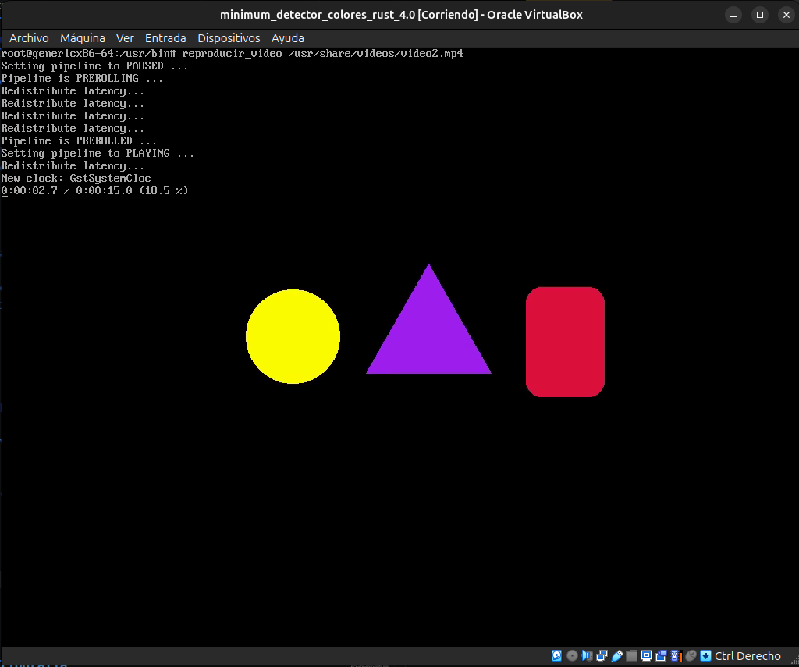
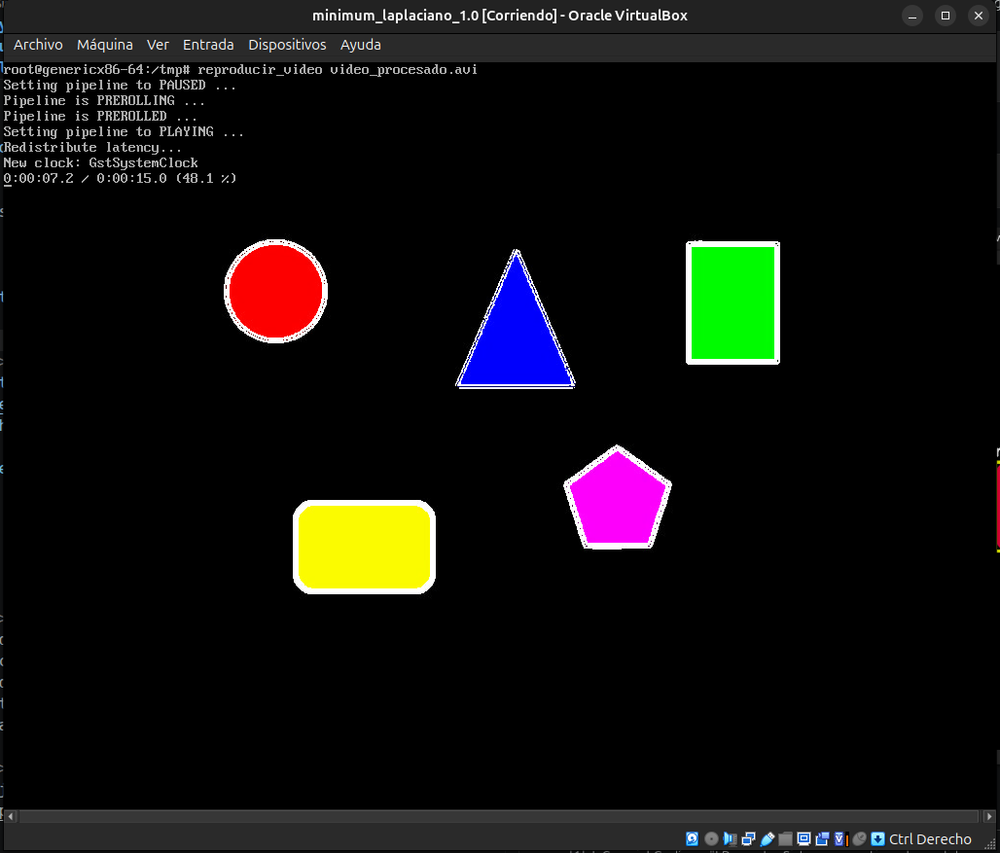

# Tutorial del proyecto I - Taller de Sistemas Embebidos
### Gabriel Pérez Ramírez - Katherine Salazar Martínez

En el presente documento se muestra el paso a paso que permite replicar los resultados obtenidos en el proyecto I del curso. En este se logra diseñar una imagen basada en Linux, la cual está hecha a la medida para poder soportar archivos multimedia y poder entonces aplicarles un código basado en Rust y OpenCV para poder obtener un resultado también en formato de multimedia, [[1]](#cite_1). Los dos enfoques principales es la de la correcta configuración del ambiente de Yocto Project, además de la explicación de la aplicación en sí, la cual se escribe en Rust y utiliza OpenCV.

## 1. Yocto Project

Yocto es un proyecto de código abierto, el cual ayuda a crear sistemas totalmente personalizados basados en Linux, independientemente de la arquitectura del hardware, [[2]](#cite_2). Este permite crear imágenes hechas a la medida para distintas aplicaciones, entre estas, sistemas embebidos con capacidades limitadas, o simplemente un sistema en el que se quiere aprovechar la totalidad de los recursos en las aplicaciones de importancia, sin estar corriendo tareas innecesarias en segundo plano.

### 1.1 Yocto en máquina local

Lo primero que hay que hacer es preparar el ambiente que va a permitir generar las imágenes personalizadas. Para esto se va a seguir la página oficial de [Yocto](https://docs.yoctoproject.org/kirkstone/brief-yoctoprojectqs/index.html). Importante que hay que cumplir con algunos requisitos mínimos, como tener Git 1.8.3.1 o más nuevo, Python 3.6.0 o más reciente, entre otros.

Se va a usar la versión de **Kirkstone 4.0.34**. Para esto se debe ejecutar el comando:

```bash
sudo apt install build-essential chrpath cpio debianutils diffstat file gawk gcc git iputils-ping libacl1 liblz4-tool locales python3 python3-git python3-jinja2 python3-pexpect python3-pip python3-subunit socat texinfo unzip wget xz-utils zstd
```

En seguida se muestra la función de cada paquete descargado con este comando. Mencionar que esta sección se ordena con ayuda de IA, [[3]](#cite_3).

- **Herramientas de compilación básicas:**
  - `build-essential`: Incluye herramientas básicas.
  - `gcc`: Compilador gcc de C/C++. Esto dado que Yocto compila todo desde código fuente.

- **Manejo de archivos, binarios y empaquetado:**
  - `cpio`: crear/extraer archivos.
  - `chrpath`: modifica rutas de librerías en binarios.
  - `diffstat`: muestra estadísticas de parches.
  - `file`: detecta tipo de archivo.
  - `unzip`, `xz-utils`, `zstd`, `liblz4-tool`: descompresión de paquetes.

- **Utilidades del sistema:**
  - `debianutils`: herramientas básicas del sistema Debian.
  - `libacl1`: soporte de permisos avanzados (ACL).
  - `locales`: manejo de idiomas/regiones.

- **Red y descarga de recursos:**
  - `git`: descarga repositorios (como Poky).
  - `wget`: descarga archivos.
  - `ping`: pruebas de conectividad.

- **Entorno de Python:**
  - `python3`: lenguaje base de BitBake.
  - `pip`: gestor de paquetes Python.
  - `jinja2`: templates (usado en configuraciones).
  - `pexpect`: automatización de procesos.
  - `python3-git`: interacción con git desde Python.
  - `subunit`: testing.

- **Comunicación y utilidades adicionales:**
  - `socat`: comunicación entre procesos/sockets.
  - `texinfo`: generación de documentación.


Luego se debe clonar el repositorio de Poky en la PC del usuario, esto con:

```bash
git clone git://git.yoctoproject.org/poky
```

Dado que se está usando la versión **Kirkstone 4.0.34**, hay que pasarse a la rama correspondiente, tal que:

```bash
git checkout -t origin/kirkstone -b my-kirkstone
```

Ya con el ambiente preparado, es importante comprobar que la instalación de todo está funcionando de manera correcta. Para esto, hay que ubicarse dentro de la carpeta `poky`, y dentro de esta se va a generar una imagen de prueba, tal que:

```bash
# Inicializa el ambiente
source oe-init-build-env

# Cocina una imagen mínima
bitbake core-image-sato

# Se simula el funcionamiento de la imagen usando QEMU
runqemu qemux86-64
```

### 1.2 Sistema objetivo

Hay que especificar el sistema o la arquitectura del SO para la que se quiere diseñar la imagen. Para hacer esto, hay que acceder al archivo `local.conf`, el cual se encuentra en la ruta:

```bash
poky
└── build
    └── conf
        ├── bblayers.conf
        ├── local.conf
        └── templateconf.cfg
```

Dentro de este hay una sección llamada ***# Machine Selection***, en la que es necesario que únicamente las siguientes dos líneas se encuentren sin comentar:

```bash
MACHINE ?= "genericx86-64"
MACHINE ??= "qemux86-64"
```
Con esto se indica que la imagen debe ser compatible con la arquitectura x86 de 64 bits, esto en un estilo genérico. La otra línea se deja sin comentar, dado que es la opción por defecto, en caso de que las demás líneas estén comentadas.

### 1.3 Capas (***Layers***) necesarias

Las capas, dentro del contexto de Yocto Project, son conjuntos de recetas disponibles, las cuales se pueden importar a la imagen objetivo, esto para darle capacidades específicas. Las capas incluidas al proyecto se encuentran en el archivo `bblayers.conf`, el cual se encuentra en la ruta:

```bash
poky
└── build
    └── conf
        ├── bblayers.conf
        ├── local.conf
        └── templateconf.cfg
```

Algunos comandos importantes para el manejo de capas se muestran en seguida. Mencionar que es necesario que el ambiente esté inicializado, por lo que hay que correr `source oe-init-build-env`, estando dentro de la carpeta de ***poky***.

```bash
# Muestra qué layers están cargadas en el proyecto
bitbake-layers show-layers

# Crea un layer nuevo
bitbake-layers create-layer meta-mi-layer

# Añade un layer al proyecto. Al usarlo, se muestra el nuevo layer en el documento `bblayers.conf`
bitbake-layers add-layer ../meta-mi-layer

# Elimina un layer del proyecto. Al usarlo, se quita el layer del documento `bblayers.conf`
bitbake-layers remove-layer ../meta-mi-layer
```

Ahora, se muestran las capas incluidas para la elaboración de la imagen, para luego explicar para qué se usan, además del proceso seguido para obtenerlas, esto en caso de ser necesario. Dentro del archivo `bblayers.conf` se encuentra:

```bash
BBLAYERS ?= " \
  /home/gabo/poky/meta \
  /home/gabo/poky/meta-poky \
  /home/gabo/poky/meta-yocto-bsp \
  /home/gabo/poky/build/meta-proyecto1 \
  /home/gabo/poky/meta-openembedded/meta-oe \
  /home/gabo/poky/meta-rust-bin \
  /home/gabo/poky/meta-clang \
  "
```

- `meta`: Capa que viene por defecto. Aquí viven la metadata base mínima, contiene recetas fundamentales.
- `meta-poky`: Capa que viene por defecto. Esta es la capa de política de distribución de Poky. Define la configuración general de la distro `poky`, incluyendo decisiones sobre cómo se construye la imagen.
- `meta-yocto-bsp`: Es la capa BSP (Board Support Package) de referencia incluida con Poky. Mantiene máquinas como la `genericx86`, que es la que se está usando.
- `meta-proyecto1`: Capa personalizada. Esta se creó con el fin de incluir las recetas particulares que se necesiten en la imagen, como el código en Rust o el video sobre el cual el código va a actuar.

Para generarla hay que seguir los siguientes comandos:

```bash
bitbake-layers create-layer meta-proyecto1
bitbake-layers add-layer ../build/meta-proyecto1
```

- `meta-openembedded/meta-oe`: Capa que proviene del proyecto OpenEmbedded. Esta se incluye para poder usar el material de OpenCV. Para poder añadir esta capa al proyecto hay que usar los siguientes comandos:

```bash
# Estando dentro de poky usar
source oe-init-build-env

# Clona los componentes de la capa dentro del repositorio local de poky
git clone -b kirkstone https://github.com/openembedded/meta-openembedded.git

# Añade la capa que se necesita al archivo bblayers.conf
bitbake-layers add-layer ../meta-openembedded/meta-oe
```
- `meta-rust-bin`: Esta capa provee toolchains de Rust ya precompiladas. La razón de usar esta capa es la de compilar aplicaciones Rust con Cargo durante el build, con esto no es necesario agregar el compilador completo de Rust dentro de la imagen final. Para poder añadir esta capa al proyecto hay que usar los siguientes comandos:

```bash
# Estando dentro de poky usar
source oe-init-build-env

# Clona los componentes de la capa dentro del repositorio local de poky
git clone https://github.com/rust-embedded/meta-rust-bin.git

# Añade la capa que se necesita al archivo bblayers.conf
bitbake-layers add-layer ../meta-rust-bin
```

- `meta-clang`: Esta capa aporta el soporte de clang/llvm como cross compiler. Se añade dado que a la hora de cocinar la receta del código, el generador de bindings de OpenCV para Rust la solicitó. Para poder añadir esta capa al proyecto hay que usar los siguientes comandos:

```bash
# Estando dentro de poky usar
source oe-init-build-env

# Clona los componentes de la capa dentro del repositorio local de poky
git clone -b kirkstone https://github.com/kraj/meta-clang.git

# Añade la capa que se necesita al archivo bblayers.conf
bitbake-layers add-layer ../meta-clang
```

### 1.4 Recetas (***Recipes***) necesarias

Las recetas son las instrucciones precisas que le dicen al sistema cómo cocinar un componente específico de software, en este caso, cómo cocinar la imagen. Estas se encuentran en un archivo de texto con extensión .bb. Este contiene metadatos y una serie de pasos lógicos que describen el ciclo de vida de un paquete de software. Estas indican dónde está el código fuente, qué dependencias deben estar listas antes de empezar a compilar el componente, ejecuta comandos necesarios para la compilación y genera archivos finales (binarios, archivos de configuración, entre otros).

Las recetas incluidas al proyecto se encuentran en el archivo `local.conf`, el cual se encuentra en la ruta:

```bash
poky
└── build
    └── conf
        ├── bblayers.conf
        ├── local.conf
        └── templateconf.cfg
```

Algunos comandos importantes para el manejo de recetas se muestran en seguida. Mencionar que es necesario que el ambiente esté inicializado, por lo que hay que correr `source oe-init-build-env`, estando dentro de la carpeta de ***poky***.

```bash
# Muestra las recetas disponibles y el layer que las provee
bitbake-layers show-recipes

# Cocina una receta de manera individual
bitbake <receta>

# Limpia los resultados de compilación, dejando la compilación desde cero.
bitbake <receta> -c cleansstate
```

Ahora, se van a mostrar las recetas que están incluidas en la generación de la imagen. Estas se encuentran casi al final del documento `local.conf`, en donde es necesario agregarlas manualmente. Luego de esto, se indica de qué layer proviene cada receta, porqué se está usando y en caso de que sea necesario, cómo crearla.

```bash
IMAGE_INSTALL:append = " \
        opencv \
        gstreamer1.0 \
        gstreamer1.0-plugins-base \
        gstreamer1.0-plugins-good \
        gstreamer1.0-plugins-bad \
        gstreamer1.0-libav \
        gstreamer1.0-plugins-ugly \
        video2 \
        laplaciano-rust \
	    video-player-cmd \
    "
```

- `opencv`: Proviene de `meta-openembedded/meta-oe`. Se usa dado que la aplicación en Rust usa OpenCV para leer y procesar el video. Es la librería central que se usa para realizar la visión por computador.
- `gstreamer1.0`: Proviene de `meta`. Es la base del framework multimedia. Se usa para poder abrir el video en la VM.
- `gstreamer1.0-plugins-base`: Proviene de `meta`. Incluye elementos esenciales, como soporte base para leer, convertir y manejar streams multimedia.
- `gstreamer1.0-plugins-good`: Proviene de `meta`. Añade demuxers, decodificadores y elementos comunes que permiten abrir videos de formato MP4.
- `gstreamer1.0-plugins-bad`: Proviene de `meta`. Amplía el soporte de formatos multimedia.
- `gstreamer1.0-libav`: Proviene de `meta`. Agrega soporte de decodificación adicional, útil para formatos que no siempre se cubren por los plugins base o good.
- `gstreamer1.0-plugins-ugly`: Proviene de `meta`. Amplía aún más el soporte multimedia.
- `video2`: Proviene de `meta-proyecto1`. Agrega el video dentro de la imagen, para que se pueda acceder a este dentro de la VM. Esta es una receta propia, por lo que lo primero que hay que hacer es crear el directorio y los archivos necesarios para que esta funcione. El árbol de esta receta debe verse como:

```bash
meta-proyecto1
└── recipes-media
    └── video2
        ├── files
        │   ├── LICENSE
        │   └── video2.mp4
        └── video2.bb
```

El archivo de formato MP4 es el video que usa el código en Rust. El archivo `LICENSE` es una formalidad recomendada dentro de la elaboración de recetas en Yocto, el contenido es:

```bash
All rights reserved. Video provided by me for testing.
```

El contenido de `video2.bb` se muestra a continuación. 

```bash
SUMMARY = "Instala un video dentro de la imagen"
LICENSE = "CLOSED"
LIC_FILES_CHKSUM = "file://LICENSE;md5=092cecf55e2bc9a2a5e8378656d2d161"

SRC_URI = "file://video2.mp4 \
           file://LICENSE \
"

S = "${WORKDIR}"

inherit allarch

do_install() {
    install -d ${D}${datadir}/videos
    install -m 0644 ${S}/video2.mp4 ${D}${datadir}/videos/video2.mp4
    install -m 0644 ${S}/LICENSE ${D}${datadir}/videos/LICENSE
}

FILES:${PN} += "${datadir}/videos ${datadir}/videos/*"
```

Ahora se explica la función de cada línea.

`SUMMARY`: Esta línea define un resumen corto de la receta.

`LICENSE`: Se pone la licencia como cerrada, dado que se usa un archivo multimedia propio, no un programa que compile desde código abierto.

`LIC_FILES_CHKSUM`: Esta línea sirve para verificar la integridad de la receta. La parte de `file://LICENSE` indica que el archivo de licencia está dentro de la receta. Mientras que el dato `md5` es una huella digital, la cual Yocto usa para comprobar que ese archivo no cambió. Para obtenerla este código, hay que estar dentro de la carpeta en la que se encuentra el archivo de licencia y usar el siguiente código:

```bash
md5sum LICENSE
```

`SRC_URI`: Indica los archivos de origen que va a usar la receta. En este caso se indica que sólo se usan dos archivos locales, el video y la licencia. El prefijo `file://` le dice a BitBake que los archivos existen dentro del árbol de la receta.

`S`: Define el directorio de trabajo principal de la receta. `WORKDIR` es la carpeta temporal donde BitBake guarda los archivos copiados desde `SRC_URI`, además de ser donde ejecuta las tareas de la receta.

`inherit allarch`: Esto le dice a Yocto que la receta es independiente de la arquitectura.

`do_install()`: Este comando es el que crea las carpetas e instala los archivos locales dentro de lo que va a estar finalmente en la imagen. El primer comando crea un directorio llamada `videos`, esto dentro de `/usr/share`. Los otros dos definen los permisos, esto con `-m 0644` (dueño lectura y escritura, grupo y otros solo de lectura). Luego indican el archivo fuente. Finalmente, muestran la ruta en donde quedará instalado el archivo dentro de la imagen.

`FILES:${PN}`: Este comando le dice a Yocto qué archivos pertenecen al paquete generado por la receta, asegurando que tanto el directorio como todo su contenido queden empaquetados dentro de la imagen final.

Luego de rellenar el archivo tipo `.bb`, se debe cocinar la receta. Para esto se siguen los siguientes comandos:

```bash
# Estando dentro de poky, inicializar el ambiente
source oe-init-build-env

# Cocinar la receta
bitbake video2
```

- `laplaciano-rust`: Proviene de `meta-proyecto1`. Es la aplicación de Rust principal, encargada de procesar el video y generar un resultado ya listo. Este se agrega a la imagen como un archivo binario.

Lo primero que hay que hacer es crear el árbol con todos los archivos necesarios por la receta, el cual se observa en seguida.

```bash
meta-proyecto1/
└── recipes-apps/
    └── laplaciano-rust/
        ├── files/
        │   ├── Cargo.lock
        │   ├── Cargo.toml
        │   └── src/
        │       └── main.rs
        └── laplaciano-rust.bb
```

El archivo `main.rs` es el código principal de la aplicación. Los dos archivos de `Cargo` se generan al compilar el rust principal. Para que estos se generen hay que seguir lo siguiente:

```bash
SUMMARY = "Detección de bordes en video con Rust y OpenCV"
LICENSE = "CLOSED"

SRC_URI = "file://Cargo.toml \
           file://Cargo.lock \
           file://src/main.rs \
"

S = "${WORKDIR}"

inherit cargo_bin

do_compile[network] = "1"

DEPENDS += "opencv clang-native llvm-native"
```

El contenido de este archivo cumple las mismas funciones que en la receta del video, con una excepciones, las cuales se mencionan a continuación:

`inherit cargo_bin`: Le indica a Yocto que esta receta debe construirse usando soporte para proyectos Rust con Cargo, en modo binario.

`do_compile[network]`: Permite el acceso a la red durante la compilación. Es importante, dado que esto permita que Cargo pueda descargar dependencias, esto en caso de ser necesario.

`DEPENDS`: Indica las bibliotecas con las cuales se tienen dependencias.


Luego de rellenar el archivo tipo `.bb`, se debe cocinar la receta. Para esto se siguen los siguientes comandos:

```bash
# Estando dentro de poky, inicializar el ambiente
source oe-init-build-env

# Cocinar la receta
bitbake laplaciano-rust
```

- `video-player-cmd`: Proviene de `meta-proyecto1`. Instala un comando corto y fácil de usar dentro de la VM, que encapsula el pipeline largo de Gstreamer, el cual se usa para reproducir el video.

El árbol que hay que crear para esta receta se ve tal que:

```bash
meta-proyecto1/
└── recipes-apps/
    └── video-player-cmd/
        ├── video-player-cmd.bb
        └── files/
            └── reproducir_video.sh
```

El archivo `reproducir_video.sh` tiene el contenido:

```bash
#!/bin/sh

VIDEO="${1:-/usr/share/videos/video.mp4}"

gst-launch-1.0 filesrc location="$VIDEO" ! decodebin ! videoconvert ! fbdevsink
```

Ahora se va a explicar el funcionamiento de cada parte del archivo.

`#!/bin/sh`: Esto tiene el nombre shebang. Le dice al SO que este archivo debe ejecutarse usando el intérprete `/bin/sh`, que es el shell estándar de Linux. Esto permite que se ejecute como un comando.

`VIDEO`: Indica que al usar el comando `reproducir_video`, luego de este se pueda pasar la ruta del video que se quiere reproducir y que esta tenga prioridad. En caso de que no se pase esta ruta, se usa una por defecto.

`gst-launch-1.0 filesrc location="$VIDEO" ! decodebin ! videoconvert ! fbdevsink`: Se construye el pipeline de Gstreamer, el cual se usa para reproducir el video directamente en la pantalla, sin tener que usar una interfaz gráfica.

| Componente | Función |
| :--- | :--- |
| **`gst-launch-1.0`** | Herramienta de línea de comandos para construir y ejecutar pipelines de GStreamer. |
| **`filesrc location="$VIDEO"`** | **Fuente:** Lee los datos crudos desde el archivo especificado en la variable de entorno `$VIDEO`. |
| **`!`** | **Link:** Actúa como el conector que pasa los datos procesados de un elemento al siguiente. Indica que la salida de este elemento es la entrada del siguiente. |
| **`decodebin`** | **Decodificador:** Detecta automáticamente el formato del archivo y selecciona el plugin de decodificación adecuado. |
| **`videoconvert`** | **Conversor:** Ajusta el formato de color y los espacios de bits para asegurar la compatibilidad con el dispositivo de salida. |
| **`fbdevsink`** | **Sumidero (Sink):** Renderiza el video directamente en el Framebuffer del sistema (típicamente `/dev/fb0`). |

---

Ahora, se muestra el contenido del archivo tipo `.bb`. La construcción de este archivo se parece mucho al equivalente en la receta del video.

```bash
SUMMARY = "Comando simple para reproducir video con GStreamer"
LICENSE = "CLOSED"

SRC_URI = "file://reproducir_video.sh"

S = "${WORKDIR}"

inherit allarch

do_install() {
    install -d ${D}${bindir}
    install -m 0755 ${S}/reproducir_video.sh ${D}${bindir}/reproducir_video
}

FILES:${PN} += "${bindir}/reproducir_video"
```

Luego de rellenar el archivo tipo `.bb`, se debe cocinar la receta. Para esto se siguen los siguientes comandos:

```bash
# Estando dentro de poky, inicializar el ambiente
source oe-init-build-env

# Cocinar la receta
bitbake video-player-cmd
```

### 1.5 Configuraciones varias

Dentro del archivo `local.conf` es necesario agregar algunas líneas. El final de este archivo debe verse como:

```bash
IMAGE_FSTYPES += "wic.vmdk wic iso"

# Limitar el uso de CPU durante la construcción
BB_NUMBER_PARSE_THREADS ?= "1"
BB_NUMBER_THREADS ?= "2"
PARALLEL_MAKE ?= "-j 2"

IMAGE_INSTALL:append = " \
        opencv \
        gstreamer1.0 \
        gstreamer1.0-plugins-base \
        gstreamer1.0-plugins-good \
        gstreamer1.0-plugins-bad \
        gstreamer1.0-libav \
        gstreamer1.0-plugins-ugly \
        video2 \
        laplaciano-rust \
	    video-player-cmd \
    "
    
LICENSE_FLAGS_ACCEPTED = "commercial"
```

`IMAGE_FSTYPES`: Indica los formatos de salida que va a tener la imagen que el BitBake va a generar. El formato `wic.vmdk` es el que VirtualBox usa.

`BB_NUMBER_PARSE_THREADS`: Le dice a Yocto cuántos hilos puede usar para parsear recetas.

`BB_NUMBER_THREADS`: Define cuántas tareas ejecuta BitBake en paralelo.

`PARALLEL_MAKE`: Controla cuántos hilos usa la compilación de cada receta.

`IMAGE_INSTALL:append`: Indica las recetas que se quieren incluir en la imagen.

`LICENSE_FLAGS_ACCEPTED`: Permite incluir paquetes marcados como licencia comercial o restringida. Esta se usa dado que GStreamer lo necesita.

### 1.6 Generación de la imagen

Ya con todas las configuraciones anteriores realizadas, queda generar la imagen. En este caso se busca crear una imagen mínima, dado que se quiere que esta tenga el menor tamaño posible. Para esto se deben usar los siguientes comandos:

```bash
# Estando dentro de poky, inicializar el ambiente
source oe-init-build-env

# Cocinar la imagen
bitbake core-image-minimal
```

## 2. Máquina Virtual

Para probar el funcionamiento de la imagen que se diseñó, se va a utilizar la herramienta [Oracle VirtualBox](https://www.virtualbox.org/). Esta se puede descargar desde la página oficial.

### 2.1 Configuración de la máquina virtual

En la presente sección se van a mostrar los distintos pasos que permiten crear y configurar correctamente la máquina virtual.

Hay que asegurarse que al acceder a `Archivo/Preferencias`, esté seleccionada la opción de ***Expert***, tal como se ve en la Figura [1](#fig_1).

<a id="fig_1"></a>
<figure style="text-align: center; margin: 20px auto;">
  
  <figcaption style="font-style: italic; color: #666;">Configuración de VirtualBox</figcaption>
</figure>

Luego de esto se debe de crear una nueva máquina virtual. Para esto se selecciona la botón ***Nueva***, con lo cual se va a abrir una pestaña como la de la Figura [2](#fig_2). Las configuraciones específicas de las distintas secciones se muestran a continuación:

<a id="fig_2"></a>
<figure style="text-align: center; margin: 20px auto;">
  
  <figcaption style="font-style: italic; color: #666;">Creación de nueva máquina virtual</figcaption>
</figure>

- **Virtual machine name and operating system:**

<a id="fig_3"></a>
<figure style="text-align: center; margin: 20px auto;">
  
  <figcaption style="font-style: italic; color: #666;"></figcaption>
</figure>

- **Set up unattended guest OS installation:**

<a id="fig_4"></a>
<figure style="text-align: center; margin: 20px auto;">
  
  <figcaption style="font-style: italic; color: #666;"></figcaption>
</figure>

- **Specify virtual hardware:**

<a id="fig_5"></a>
<figure style="text-align: center; margin: 20px auto;">
  
  <figcaption style="font-style: italic; color: #666;"></figcaption>
</figure>

Mencionar que es necesario desactivar la configuración de ***Secure Boot*** desde la ***UEFI*** de la computadora del usuario. En caso de no hacerlo, la imagen puede dar errores.

- **Specify virtual hard disk:** En la presente pestaña hay que seleccionar la opción mostrada en la imagen.

<a id="fig_6"></a>
<figure style="text-align: center; margin: 20px auto;">
  
  <figcaption style="font-style: italic; color: #666;"></figcaption>
</figure>

Luego de esto hay que seleccionar la carpeta que permite navegar y buscar el archivo de imagen. La pestaña que saldrá se ve en seguida. Dentro de esta hay que seleccionar la opción ***Añadir***. Mencionar que la cantidad de archivos que aparecen se debe a las diversas máquinas virtuales que se han creado.

<a id="fig_7"></a>
<figure style="text-align: center; margin: 20px auto;">
  
  <figcaption style="font-style: italic; color: #666;"></figcaption>
</figure>

Al seleccionar el ***Añadir*** va a aparecer el navegador de archivos, en donde hay que encontrar la imagen que se creó en la sección anterior. Para esto, hay que navegar dentro de los archivos por la siguiente ruta. Los números de la imagen creada en cuestión van a variar, dado que estos identifican la imagen por el momento exacto en el que fue creada.

```bash
poky/
└── build/
    └── tmp/
        └── deploy/
            └── images/
                └── genericx86-64/
                    └─── core-image-minimal-genericx86-64-20260326232022.rootfs.wic.vmdk
```

Luego se hace click en el botón ***Seleccionar***. Finalmente se hace click sobre el botón Finalizar de la siguiente imagen, creando así la máquina virtual.

<a id="fig_8"></a>
<figure style="text-align: center; margin: 20px auto;">
  
  <figcaption style="font-style: italic; color: #666;"></figcaption>
</figure>

### 2.2 Dentro de la máquina virtual

Para abrir la máquina virtual se debe hacer doble click sobre esta. Se abrirá una pestaña que nos permite interactuar con la VM. Lo primero que debería aparecer es un menú de ***GRUB***, al cual hay que dar ***Enter*** para seguir.

Luego hay que ingresar los datos de login, que en este caso es `root`. Ya con esto se estará dentro de la máquina.

Si se quiere confirmar que los archivos de las recetas existen, estos se pueden buscar de la siguiente forma.

- **Video:** Este se encuentra con el comando.

```bash
cd /usr/share/videos
```
- **Archivo de rust:** Este se encuentra en `/usr/bin` y se llama `detector-colores-rust-VM`.

Antes de correr el código de rust, se quiere visualizar el video original. Para esto se corre el siguiente comando.

```bash
reproducir_video /usr/share/videos/video2.mp4
```

<a id="fig_9"></a>
<figure style="text-align: center; margin: 20px auto;">
  
  <figcaption style="font-style: italic; color: #666;"></figcaption>
</figure>

Ahora se quiere correr el archivo binario de rust. Esto se hace con el comando que se muestra en seguida.

```bash
mi-app-opencv /usr/share/videos/video2.mp4
```
Con esto se crea un video ya modificado por el código de rust. Este se guarda en la siguiente ruta:

```bash
tmp/
└── video_procesado.avi/
```

Y este se puede visualizar de manera análoga al video anterior, tal que:

```bash
reproducir_video /tmp/video_procesado.avi
```

<a id="fig_10"></a>
<figure style="text-align: center; margin: 20px auto;">
  
  <figcaption style="font-style: italic; color: #666;"></figcaption>
</figure>


## #. Bibliografía

<a id="cite_1"></a>
[1] J. Carvajal Godínez, "I Proyecto: Sistema operativo a la medida para aplicaciones embebidas con la biblioteca OpenCV en RUST con el marco de trabajo de Yocto Project," Instituto Tecnológico de Costa Rica, Escuela de Ingeniería Electrónica, Cartago, Costa Rica, Instructivo de Proyecto, I Semestre 2026.

<a id="cite_2"></a>
[2] "The Yocto Project," Yocto Project, 2024. [En línea]. Disponible en: https://www.yoctoproject.org/. [Accedido: 29-mar-2026].

<a id="cite_3"></a>
[3] OpenAI, "ChatGPT," (versión Mar 29), [Software], 2026. Disponible en: https://chatgpt.com/. [Accedido: 29-mar-2026].