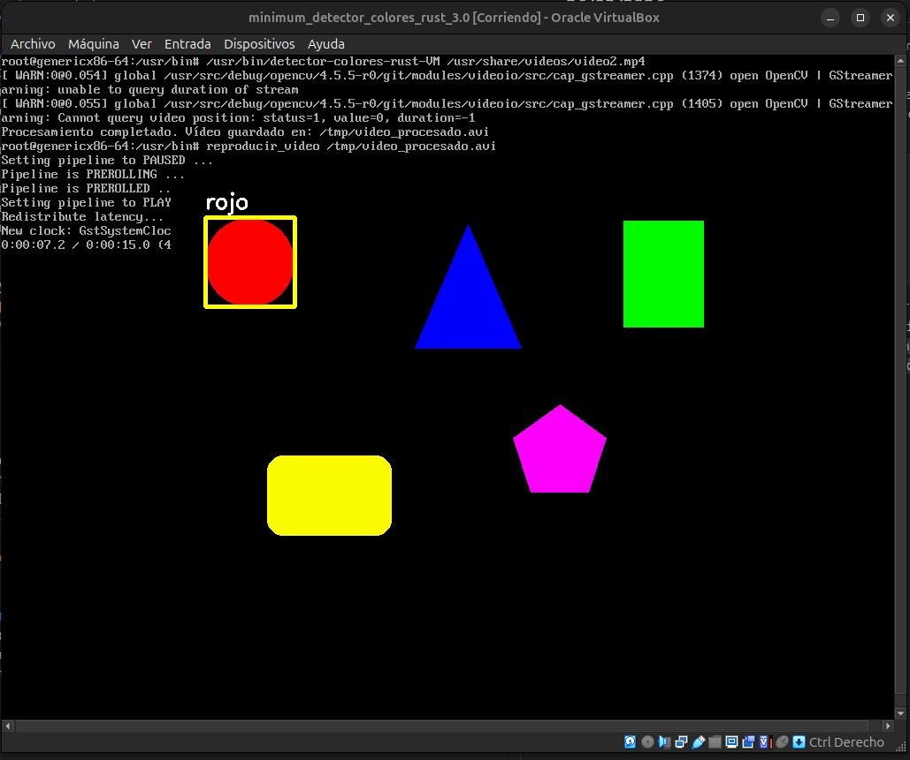

## 21/03/2026

- Se quiere crear una imagen que pueda correr de manera solvente código en Rust. De momento no se tiene claro si lo ideal es agregar todas las herramientas de este lenguaje a la imagen, como cargo, o si se podrá generar el código y algún tipo de ejecutable desde la máquina, luego cocinar la receta de esta y que sea este el que se ejecute dentro de la VM.
- De momento se está tratando de implementar un código detector de colores sencillo, el cual usa opencv. Está dando errores a la hora de hacer el `cargo build`, específicamente con el `opencv`. Para agregar el `opencv`, hay que ejecutar el comando `cargo add opencv`. Este va a agregar la biblioteca al archivo `Cargo.toml`. Parece que en realidad el error venía del código propiamente, algo relacionado con los préstamos de las máscaras que no se estaba implementando de manera correcta.
- Ya con este código funcional, se decide adaptarlo para que no necesite una interfaz gráfica, sino que genere un video resultante. Esto con el fin de que pueda ejecutarse en la VM.
- Para esto hay que identificar qué layers y recetas hay que agregar en el bitbake de la imagen. Se va a importar una layer llamada `meta-rust-bin`. Esta permite compilar el archivo de rust en la creación de la imagen, pero no propiamente en el target. Parece conveniente, para no agrandar la imagen más de lo estrictamente necesario. Esta se puede obtener con el comando:

```bash
git clone https://github.com/rust-embedded/meta-rust-bin.git
bitbake-layers add-layer ../meta-rust-bin
```
- La otra opción sería bajar `meta-rust`, el cual sí hace posible usar cargo y compilar dentro del target, esto con:

```bash
git clone https://github.com/meta-rust/meta-rust.git
bitbake-layers add-layer ../meta-rust
```

- Entonces se busca cocinar la receta del código de rust. El árbol de esta queda como:

```bash
meta-proyecto1/
└── recipes-apps/
    └── detector-colores-rust/
        ├── detector-colores-rust_0.1.bb
        └── files/
            ├── Cargo.toml
            ├── Cargo.lock
            └── src/main.rs
```
- Y el contenido del .bb es:

```bash
SUMMARY = "Detección de color en video con Rust y OpenCV"
LICENSE = "CLOSED"

SRC_URI = "file://Cargo.toml \
           file://Cargo.lock \
           file://src/main.rs \
"

S = "${WORKDIR}"

inherit cargo_bin

do_compile[network] = "1"

DEPENDS += "opencv"
```

- Al tratar de cocinar la receta de manera individual, esta da errores con respecto a una dependencia, llamada `clang`. Dado esto, se necesita agregar esta al poky. Esto se hace con:

```bash
git clone -b kirkstone https://github.com/kraj/meta-clang.git
bitbake-layers add-layer ../meta-clang
```

- Luego de agregar el `meta-clang`, la receta del código dn rust sí se cocinó correctamente, al igual que la imagen mínima. Queda pendiente comprobar el funcionamiento del código dentro de la VM.

### Errores / Problemas
- Fallo con el `cargo build`, específicamente con el `opencv`.
- Falta dependencia `clang` al cocinar la receta con el código de rust.


## 26/03/2026
- El último día de trabajo se consiguió cocinar la imagen mínima con el código de Rust, ver si este funciona es la primera comprobación que se busca hacer.

- Antes de probar esto, se decide crear una receta sencilla, que simplemente sea un atajo para poder ingresar el comando que reproduce el video dentro de la VM. La receta se llama `video-player-cmd` y su árbol está conformado por:

```bash
meta-proyecto1/
└── recipes-apps/
    └── video-player-cmd/
        ├── video-player-cmd.bb
        └── files/
            └── reproducir_video.sh
```

- Dentro de la imagen se logra comprobar que al ejecutar el binario creado del código en rust, se crea de manera satisfactoria el video ya con la intervención de dicho código. Dentro de la VM el código se ejecuta con `/usr/bin/detector-colores-rust-VM /usr/share/videos/video2.mp4`. Luego de eso, se reproduce el video con el comando `reproducir-video /tmp/video_procesado.avi`. Esto se puede observar a continuación:

<figure style="text-align: center; margin: 20px auto;">
  
  <figcaption style="font-style: italic; color: #666;">Detección de un color usando código de rust, dentro de VirtualBox</figcaption>
</figure>

- Dentro del `local.conf` las líneas agregadas quedan como:

```bash
IMAGE_FSTYPES += "wic.vmdk wic iso"
#IMAGE_FSTYPES += "vmdk"

# Limitar el uso de CPU durante la construcción
BB_NUMBER_PARSE_THREADS ?= "1"
BB_NUMBER_THREADS ?= "2"
PARALLEL_MAKE ?= "-j 2"

IMAGE_INSTALL:append = " \
        opencv \
        gstreamer1.0 \
        gstreamer1.0-plugins-base \
        gstreamer1.0-plugins-good \
        gstreamer1.0-plugins-bad \
        gstreamer1.0-libav \
        gstreamer1.0-plugins-ugly \
        video2 \
        reconocimiento-colores-rust \
	video-player-cmd \
    "
    
LICENSE_FLAGS_ACCEPTED = "commercial"
```

- Mientras que dentro del `bblayers.conf` las líneas agregadas quedan como:

```bash
BBLAYERS ?= " \
  /home/gabo/poky/meta \
  /home/gabo/poky/meta-poky \
  /home/gabo/poky/meta-yocto-bsp \
  /home/gabo/poky/build/meta-proyecto1 \
  /home/gabo/poky/meta-openembedded/meta-oe \
  /home/gabo/poky/meta-rust-bin \
  /home/gabo/poky/meta-clang \
  "
```

### Errores / Problemas
- En un descuido se creó la imagen sin haber cambiado la receta del reconocimiento de colores, por lo que se agregó nuevamente la de python en lugar de la de rust.