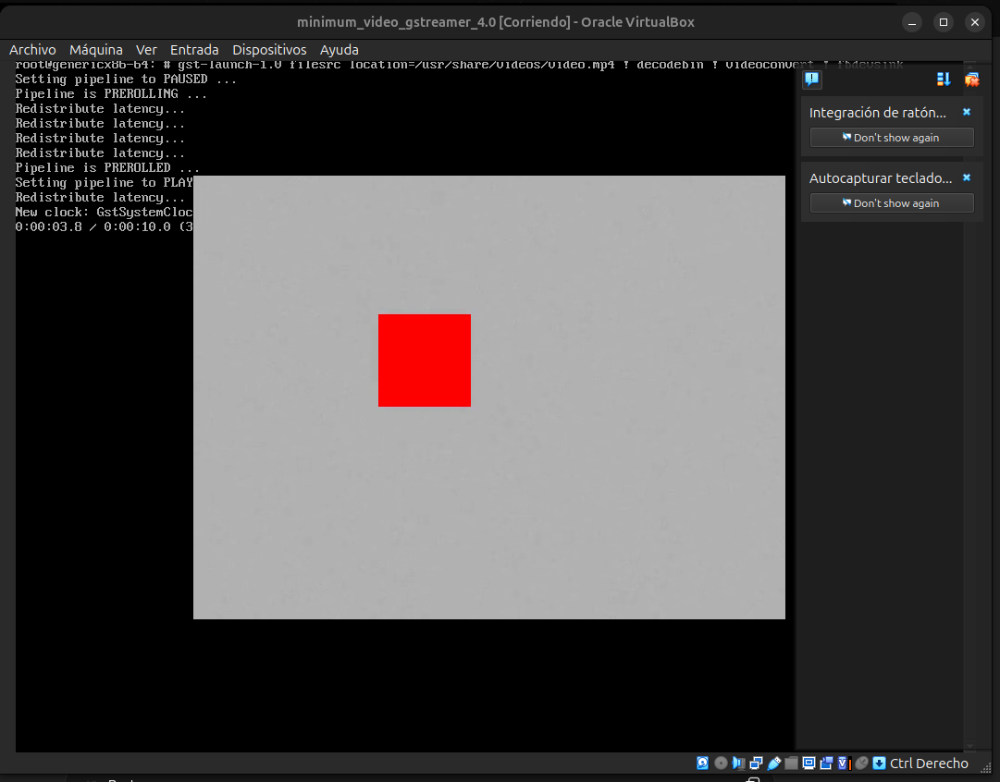

## 14/03/2026
- Se busca realizar una imagen mínima, pero que tenga la posibilidad de reproducir un video dentro de esta. Para esto se decide usar el reproductor gstreamer1.0, el cual está disponible dentro del layer meta. Para agregar este paquete en la siguiente imagen, simplemente se agrega al archivo `local.conf`. Mientras que para agregar el video, se debe crear una nueva layer, en donde posteriormente se va a agregar la receta que propiamente incluye al archivo de mp4. Para crear el layer se siguen los siguientes comandos.

```bash
    source oe-init-build-env
    bitbake-layers create-layer meta-proyecto1
    bitbake-layers add-layer meta-proyecto1
```

- En primera instancia se va a crear el directorio en el que va a generarse la receta para archivos de video, para esto se debe colocar la terminal dentro de la carpeta de la layer propia, es decir, `meta_proyecto1`. Luego se usa el comando:

```bash
    mkdir -p recipes-media/mi-video/files
```
- Luego de esto, se copia el video en cuestión dentro de la carpeta `files`. Además, debe crearse un archivo de tipo `LICENSE`, dentro de la misma carpeta. En seguida, se debe obtener el dato de la suma md5 del archivo de licencia. Este dato se usa para comprobar la integridad del archivo en cuestión. Para esto se usa, estando dentro de la carpeta `files`.

```bash
    md5sum LICENSE
```

- Luego de esto, lo que se hace es crear un archivo de tipo .bb, en el cual se coloca propiamente la receta. Este debe ubicarse en la carpeta `recipes-media/mi-video`, y en este caso debe contener lo siguiente.

```bash
    # Descripción corta del paquete.
    SUMMARY = "Instala un video dentro de la imagen"

    # Indica que el contenido tiene licencia cerrada.
    LICENSE = "CLOSED"

    # Archivo de licencia y su MD5 para verificar integridad.
    LIC_FILES_CHKSUM = "file://LICENSE;md5=092cecf55e2bc9a2a5e8378656d2d161"

    # Archivos fuente que BitBake copiará al WORKDIR.
    SRC_URI = "file://video.mp4 \
            file://LICENSE \
    "

    # Directorio donde BitBake considera que están los archivos fuente.
    S = "${WORKDIR}"

    # Indica que el paquete es independiente de la arquitectura.
    inherit allarch

    # Tarea que copia archivos al rootfs temporal (${D}).
    do_install() {

        # Crea el directorio destino /usr/share/videos.
        install -d ${D}${datadir}/videos

        # Copia el video al rootfs con permisos de solo lectura para usuarios.
        install -m 0644 ${S}/video.mp4 ${D}${datadir}/videos/video.mp4

        # Copia también el archivo de licencia.
        install -m 0644 ${S}/LICENSE ${D}${datadir}/videos/LICENSE
    }

    # Define qué archivos pertenecen al paquete final.
    FILES:${PN} += "${datadir}/videos ${datadir}/videos/*"
```

- Ahora, se debe cocinar la receta de manera individual, para confirmar que esta funciona, y luego agregarla a la imagen. Para esto se usa el comando: 

```bash
    source oe-init-build-env
    bitbake mi-video
```

- La generación de esta receta dio bastantes errores. El código que se muestra como contenido del .bb de la receta es la versión final. Antes de llegar a este, daba errores como que el bitbake estaba instalando los archivos en el `sysroot (${D})`, pero que no los incluyó en ningún paquete, es decir, problemas en cómo bitbake estaba empaquetando los paquetes. 
- Para realizar una verificación de que la receta se creó y empaquetó correctamente, se pueden usar los siguientes comandos: 

```bash
    # lista los paquetes creados por la build (debe aparecer "mi-video")
    oe-pkgdata-util list-pkgs | grep mi-video || true

    # lista los archivos incluidos en el paquete mi-video
    oe-pkgdata-util list-pkg-files mi-video || true
    # Salida esperada
    # /usr/share/videos/video.mp4
    # /usr/share/videos/LICENSE
```
- Luego, se agrega la receta al `local.conf` para que esté disponible dentro de la imagen, la cual se crea exitosamente. Dentro de esta se verifica que el video exista, el cual está ubicado en la ruta `usr/share/videos/video.mp4`. 
- Igualmente, se verifica que el gstreamer esté disponible viendo su versión con `gst-launch-1.0 --version`. No obstante, al tratar de abrir el video con esta herramienta, se da el caso de que ninguno de los comandos / plugins funciona. Se cree que es dado que en la receta solo se agregó la línea `gstreamer1.0`. Se van a agregar ahora de forma que quede:

```bash
    IMAGE_INSTALL:append = " \
            python3 \
            git \
            vim \
            gstreamer1.0 \
            gstreamer1.0-plugins-base \
            gstreamer1.0-plugins-good \
            gstreamer1.0-plugins-bad \
            gstreamer1.0-libav \
            gstreamer1.0-plugins-ugly \
            mi-video \
        "
        
    LICENSE_FLAGS_ACCEPTED = "commercial"
```
- Parece que con esto el video sí si está corriendo, no obstante, dado que la imagen no posee entorno gráfico, no se puede observar el video. Se agregan algunas recetas más y con estas se logra correr el video con el comando `runqemu genericx86-64`. Ahora se tiene que solucionar el hecho de que no funciona en la máquina virtual. Con agregar los siguientes paquetes se logra reproducir el video.

```bash
    GE_INSTALL:append = " \
            python3 \
            git \
            vim \
            gstreamer1.0 \
            gstreamer1.0-plugins-base \
            gstreamer1.0-plugins-good \
            gstreamer1.0-plugins-bad \
            gstreamer1.0-libav \
            gstreamer1.0-plugins-ugly \
            mi-video \
            xserver-xorg \
            xinit \
            matchbox-wm \
        "
        
    LICENSE_FLAGS_ACCEPTED = "commercial"
```
- Dentro de la VM se usa `gst-launch-1.0 filesrc location=/usr/share/videos/video.mp4 ! decodebin ! videoconvert ! fbdevsink`. Con eso se obtiene:

<figure style="text-align: center; margin: 20px auto;">
  
  <figcaption style="font-style: italic; color: #666;">Comprobación de imagen mínima con Rust y Python, en VirtualBox</figcaption>
</figure>

- Finalmente se determina que con las siguientas recetas es suficiente para que el video se reproduzca de manera correcta dentro de la VM.

```bash
    IMAGE_INSTALL:append = " \
            python3 \
            git \
            vim \
            gstreamer1.0 \
            gstreamer1.0-plugins-base \
            gstreamer1.0-plugins-good \
            gstreamer1.0-plugins-bad \
            gstreamer1.0-libav \
            gstreamer1.0-plugins-ugly \
            mi-video \
        "
```